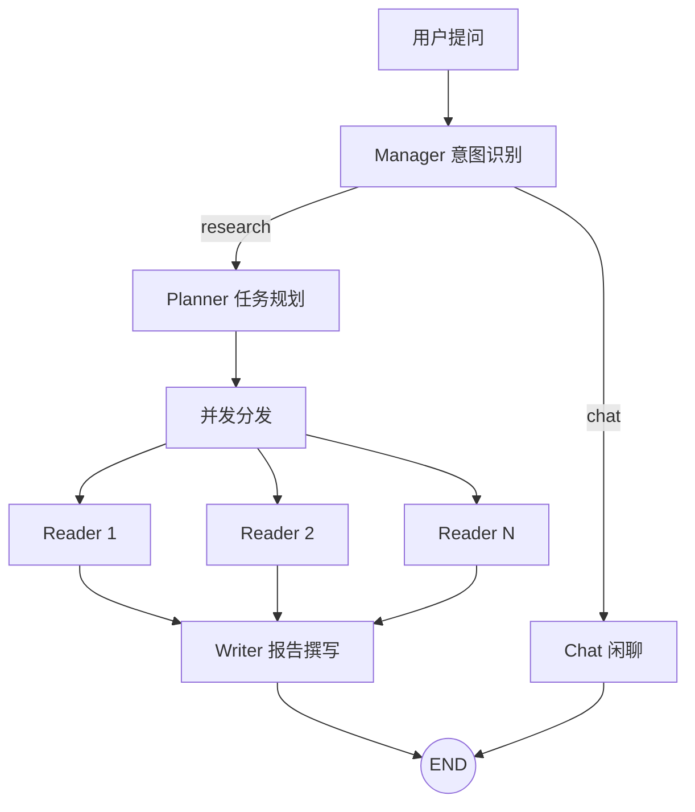

# 🕵️ Research Agent

> 本地知识库智能问答系统
> **LangGraph + MCP + RAG + FlashRank**


---

## 📖 项目简介

一个基于 LangGraph 多智能体架构的本地知识库问答系统。

把文档放进 `data/` 目录，用自然语言提问，系统会自动规划检索策略、并发读取文件、生成结构化报告。

---

## 🧠 系统架构



---

## ✨ 核心功能

### 多智能体协作
- **Manager**：意图识别，分流 chat/research
- **Planner**：将复杂问题拆解为 2-4 个子任务
- **Reader**：并发调用 MCP 工具检索知识库
- **Writer**：汇总数据，生成结构化报告
- **Chat**：处理日常对话

### 智能检索
- **向量检索**：ChromaDB + 语义 Embedding
- **精排序**：FlashRank 重排序提升准确率
- **置信度**：每条结果附带相似度分数

### 多格式支持
- PDF（pdfplumber）
- Word（python-docx）
- Markdown / TXT（自动编码检测）

### 增量索引
- 文件指纹检测（mtime），变动文件才重建
- 秒级启动，无需重复向量化

### 流式输出
- SSE 实时推送执行阶段
- 前端可见工具调用过程

---

## 🧩 项目结构

```text
research-agent/
├── agents/                 # 多智能体模块
│   ├── manager.py         # 意图识别
│   ├── chat.py            # 闲聊处理
│   ├── planner.py         # 任务规划
│   ├── reader.py          # 知识检索
│   └── writer.py          # 报告撰写
├── tools/                  # MCP 工具
│   ├── mcp_server_local.py    # MCP 服务
│   ├── rag_store.py           # RAG 检索
│   └── registry.py            # 工具注册
├── api/                    # 后端接口
│   ├── routes.py          # 路由
│   └── stream.py          # SSE 流式处理
├── frontend/               # Streamlit 前端
│   ├── app.py
│   ├── chat_flow.py
│   └── backend_client.py
│   └── ui.py
├── bootstrap/              # 生命周期管理
├── data/                   # 知识库文件目录
├── chroma_db/              # 向量数据库
├── graph.py                # LangGraph 编排
├── state.py                # 状态定义
├── server.py               # FastAPI 入口
├── config.py               # 配置
├── Dockerfile
└── docker-compose.yml
```

---

## ⚡ 快速开始

### 1. 克隆项目
```bash
git clone https://github.com/你的用户名/research-agent.git
cd research-agent
```

### 2. 配置环境变量
```bash
cp .env.example .env
```

编辑 `.env`：
```bash
# LLM 配置
OPENAI_MODEL=deepseek-chat
OPENAI_API_KEY=sk-xxx
OPENAI_BASE_URL=https://api.deepseek.com/v1

# Embedding 配置（默认云端模式）
EMBEDDING_API_KEY=sk-xxx
EMBEDDING_BASE_URL=https://api.siliconflow.cn/v1
EMBEDDING_MODEL_NAME=BAAI/bge-m3

# 可选：LangSmith 追踪
LANGCHAIN_API_KEY=xxx
```

### 3. 放入知识库文件
```bash
cp 你的文件.pdf data/
cp 你的文档.docx data/
```

### 4. Docker 部署
```bash
docker compose up -d --build
```

服务启动后：
- **MCP Server**：`http://localhost:8003`
- **Backend API**：`http://localhost:8011`

### 5. 启动前端（本地）
```bash
streamlit run frontend/app.py
```

或部署到 **Streamlit Cloud**，在 Secrets 配置：
```toml
BACKEND_URL = "http://你的服务器IP"
```

---

## 🔧 MCP 工具

| 工具 | 功能 | 参数 |
|------|------|------|
| `list_local_files` | 列出知识库文件 | 无 |
| `read_local_file` | 读取文件全文 | `filename` |
| `search_local_knowledge` | 语义检索 | `query` |

---

## 🖼️ 使用示例

### 研究模式
```
用户: 帮我分析所有文档中关于用户增长的策略

系统:
🧭 正在规划阅读策略...
📂 正在翻阅本地资料库...
  🔨 调用工具: search_local_knowledge
  🔨 调用工具: read_local_file
✍️ 正在提炼核心观点...

【最终报告】
基于本地文档分析，用户增长策略包括...
```

### 闲聊模式
```
用户: 你能做什么？

系统:
我是一个部署在本地的私有化知识库 Agent。您可以把 TXT/MD/PDF/DOCX 
等资料放在我的 data 目录下，我能帮您并发阅读、精准检索，并生成
深度的交叉对比报告。
```

---

## 🛠️ 技术栈

| 类别 | 技术 |
|------|------|
| 编排框架 | LangGraph |
| 协议 | MCP (fastmcp) |
| 后端 | FastAPI + SSE |
| 前端 | Streamlit |
| 向量数据库 | ChromaDB |
| Embedding | OpenAI API 兼容 |
| 重排序 | FlashRank |
| 文件解析 | pdfplumber, python-docx |
| 持久化 | SQLite (checkpointer) |

---

## 📊 Embedding 模式

在 `config.py` 中切换：

```python
# True = 本地模式（需要 16G+ 内存）
# False = 云端模式（默认）
USE_LOCAL_EMBEDDING = False
```

---

## 🗺️ Roadmap

- [ ] 支持 Excel / CSV
- [ ] 支持图片 OCR
- [ ] 本地 LLM 方案（Ollama）
- [ ] Web 文件管理界面

---

## 🤝 贡献

- 📬 提交 Issue / PR：欢迎提出改进建议或贡献代码！
- 📩 技术交流：微信 a19731567148（备注 Agent）

🌟 如果这个项目帮到了你，请给我点个 Star ⭐，这将是我持续更新的最大动力！